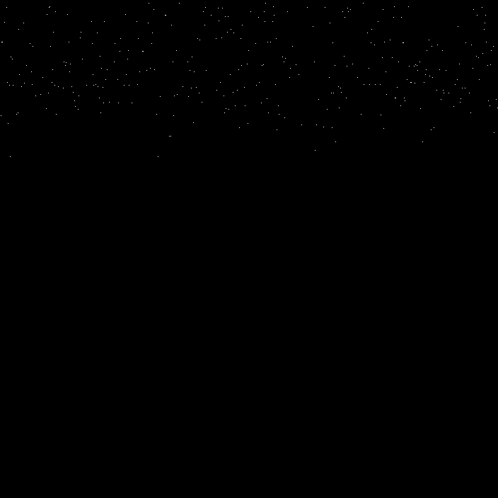
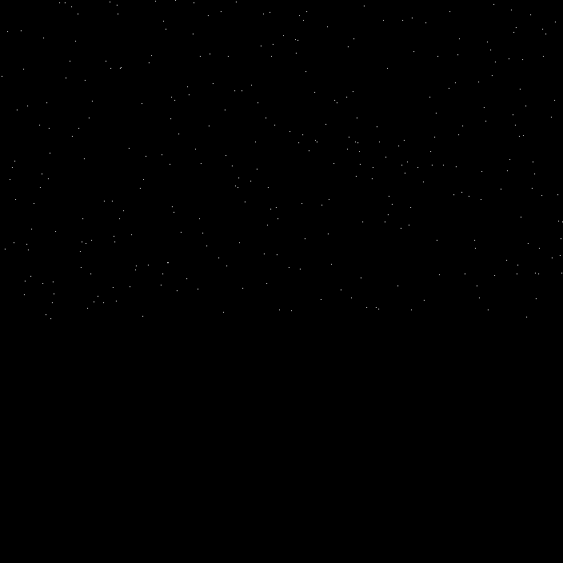
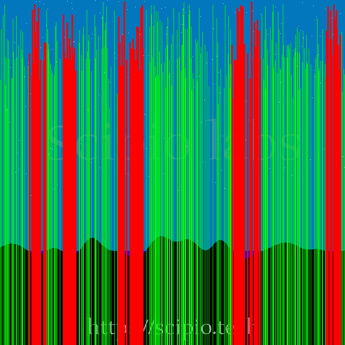

# Detecção de Colisão de Meteoros com Lago / Meteor Lake Collision Detection

## Português 🇧🇷

### Descrição do Problema
O desafio consiste em analisar uma imagem contendo meteoros (representados por traços vermelhos), estrelas (pontos brancos) e um lago (área azul). O objetivo é determinar quantos meteoros colidirão com o lago, assumindo que eles seguem uma trajetória vertical para baixo.

### Componentes da Solução

#### 1. Processamento de Imagem
- Utilização do OpenCV para carregar e processar a imagem
- Conversão do espaço de cores BGR para HSV para melhor detecção de cores
- Criação de máscaras para identificar diferentes elementos:
  - Máscara branca: detecta estrelas
  - Máscara vermelha: detecta meteoros
  - Máscara azul: detecta o lago

```python
# Converter imagem para HSV
hsv = cv2.cvtColor(img, cv2.COLOR_BGR2HSV)

# Criar máscaras
mask_branco = cv2.inRange(hsv, lower_white, upper_white)
mask_vermelho = cv2.bitwise_or(mask_vermelho_light, mask_vermelho_dark)
mask_lago = cv2.inRange(hsv, lower_blue, upper_blue)
```

#### 2. Detecção de Meteoros
- Identificação dos contornos dos meteoros usando `cv2.findContours`
- Localização do ponto mais alto de cada meteoro (menor coordenada y)
- Armazenamento das posições iniciais para análise de trajetória

```python
contours_meteoros, _ = cv2.findContours(mask_vermelho, cv2.RETR_EXTERNAL, cv2.CHAIN_APPROX_SIMPLE)
meteoros_iniciais = []
for contour in contours_meteoros:
    top_point = tuple(contour[contour[:, :, 1].argmin()][0])
    meteoros_iniciais.append(top_point)
```

#### 3. Análise de Colisão
- Para cada meteoro, é traçada uma linha vertical do seu ponto mais alto até a base da imagem
- Verificação de intersecção com a máscara do lago ao longo da trajetória
- Contagem das colisões identificadas

```python
for meteor_start in meteoros_iniciais:
    x, y = meteor_start
    colidiu = False
    for y_pos in range(y, altura):
        if mask_lago[y_pos, x] > 0:
            colidiu = True
            break
    if colidiu:
        cont_meteoro += 1
```

#### 4. Visualização
- Exibição da imagem original com trajetórias previstas
- Trajetórias em verde: caminho previsto do meteoro
- Trajetórias em vermelho: meteoros que colidirão com o lago
- Exibição das máscaras separadas para análise visual

<div align="center">

### Máscara da posição dos meteoros

A seguinte imagem exibe pontos das coordenadas dos meteoros na imagem original.



### Máscara da posição das estrelas

A seguinte imagem exibe pontos das coordenadas das estrelas na imagem original.



### Todos os elementos

A seguinte imagem exibe todos os elementos que nos interessam destacados em suas respectivas cores.


### Trajetória dos meteoros

A seguinte imagem exibe em vermelho as linhas da trajetória dos meteoros que colidem com a água, em verde a trajetória dos que não colidem.



</div>

### Como Usar

1. Defina os intervalos de cores HSV:
```python
branco = ((0, 0, 200), (180, 30, 255))
vermelho = (
    (0, 100, 100), (10, 255, 255),
    (160, 100, 100), (180, 255, 255)
)
azul = ((100, 150, 200), (130, 255, 255))
```

2. Execute a função principal:
```python
estrelas, meteoros, qtd_colisao = contar_pontos_e_colisoes(imagem, branco, vermelho, azul)
```

---